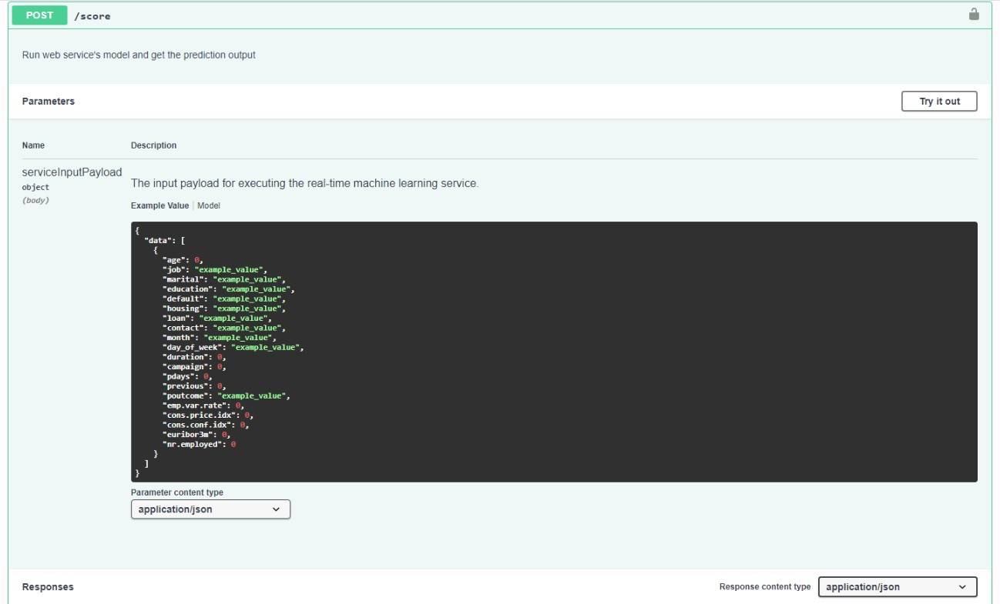

# Operationalizing Machine Learning

In this project our first goal was to configure an AutoML Classification run using the Bankmarketing dataset and deploy the best model, then set-up the endpoint for it and consume it. The main steps were:
1. Set-up an AutoML run and deploy the best model;
2. Enable logging and create Swagger documentation;
3. Consume the model endpoint.

Our second goal was to configure an Pipeline with AutoML on the Bankmakreting dataset and publish it, then consume the endpoint for it. The main steps for this part were:
1. Create resources (Experiment, Compute cluster, etc.) and Pipeline;
2. Publish the Pipeline;
3. Consume the Pipeline endpoint. 

## Architectural Diagram

Below we have the architectural diagram for both the model deployment part and the pipeline deployment part.

In the model deployment section, we see that we first use ML Studio to create a compute cluster and upload the Bankmarketing dataset, which are then used to feed in the AutoML run with a classification. Once finished, we deploy the best model usin Azure Container Instances (ACI) and enabling Authentication. Once deployed, we use a python script to enable logging and Application Insights for monitoring. Then, we use the swagger.json that ML Studio provides for the deployed model. This is used in the swagger.sh to spin up a docker container with Swagger and this provides us the model endpoint documentation with details served by a python script. Lastly, this documentation is used in our endppoint.py python script to consume the model endpoint.

In the pipeline deplpyment section, we use a compute instance to run the Jupyter Notebook. In the notebook, we use the config.json from ML Studio to configure a workspace and an Experiment, and we also check if there is a compute cluster created and if not create one. Then, we build a Pipeline with an AutoML step and publish it. Once published, we we have our REST endpoint and consume it.

In order to improve the AutoML model performance, we could increase the Training job time to 2 hours giving the algorithms more time to learn the dataset and improve their predictions. We could also use the AUC Weighted specifically as the primary metric as it is a better choice than Accuracy for imbalanced datasets like the Bankmarketing one. This will allow the models to shoot for better performance in the right metric. Another strategy is to use a larger sample space in conjunction with Random Parameter Sampling.

## Key Steps

The key steps in our project were the following:
1. Create and use a service principal to authenticate (this is not required because we used the Udacity Lab Environment);
2. Create an AutoML run with the below configuration and substeps:

    * Configure a compute cluster;
    
    * Upload the Bankmarketing dataset;
    
    
    
    * Wait for the Experiment to be completed;
    
    
    
    * Find details about the best model;
    
    
    
    

3. Deploy the best model using Azure Container Instance (ACI) and enabling Authentication);

    
    
    

4. Enable Application Insights and logging using the logs.py, Azure Python SDK in Git Bash;

    
    
    
5. Create Swagger documentation using the following:

    * The swagger.json from the deployed model;
    
    
    * The swagger.sh shell script; 
    
    
    * Spin up a Docker container with Swagger (default);
    
    
    * The serve.py python script to provide the model endpoint and see the score method;
    
    
    

6. Consume the model endpoint using the endpoint.py python script and set-up a load-test benchmark for the model using the benchmark.sh shell script and the Apache Benchmark tool:

    * JSON output from the deployed model:
    
    * Output Apache Benchmark benchmark.sh:
    

7. Create, publish and consume a Pipeline using a Jupyter Notebook:

    * Created Pipeline in ML Studio with below details:
    
    
    * Pipeline Endpoint:
    
    
    * Bankmarketing dataset:
    
    
    
    * Active Pipeline Endpoint:
    
    
    * Jupyter Notebook with RunDetails Widget running:
    
    
    * Scheduled run in ML Studio:
    

## Screen Recording

Below, we have a screencast that demostrates: 
* Working deployed ML model endpoint.
* Deployed Pipeline
* Available AutoML Model
* Successful API requests to the endpoint with a JSON payload

## Standout Suggestions

In this project, after deploying the best model with enabled logging as well as set-up a benchmark using the Apache Benchmark tool and the benchmark.sh shell script.
